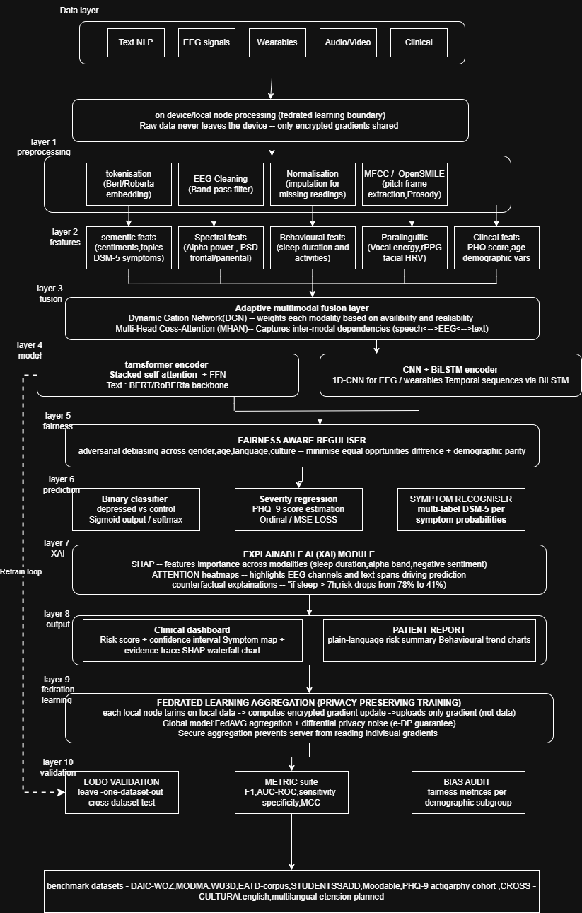

# PPEMDD

**Privacy-preserving, explainable, multimodal depression detection.** Federated learning, availability-aware gating and multi-head cross-attention, with three answers from a single pass: a depression screen, a PHQ-9 severity score and DSM-5 symptoms.

<picture>
  <source media="(prefers-color-scheme: dark)" srcset="docs/ppemdd-dark.svg">
  
</picture>

> **Status.** The full pipeline runs end to end in PyTorch. The results below use **real text only** (Reddit and WU3D posts). EEG, wearable, audio/video and clinical inputs pass through the same encoders and gate as **zero-mean placeholders** until real recordings are added; a DAIC-WOZ loader is included for that step. The gate is built to down-weight a missing or unreliable signal, which is what lets the model answer with any subset of inputs.

## Results: held-out text

2,250 samples never seen in training or threshold tuning (a 70/15/15 split with the test indices saved), decision threshold 0.15 tuned on the validation split, centralized training mode.

| Accuracy | Precision | Recall | F1 |
|:-:|:-:|:-:|:-:|
| **91.24%** (2053 / 2250) | 0.7697 | 0.7923 | **0.7809** |

| | Predicted normal | Predicted depressed |
|---|--:|--:|
| **True normal** | 1702 | 105 |
| **True depressed** | 92 | 351 |

Reproduce from `depression_detection/`:

```bash
python run_all.py --max_samples 15000 --fl_rounds 12 --fl_sigma 0.0 --no_class_weights \
  --allow_train_on_wu3d --centralized --max_eq_odds_gap 1.0 \
  --skip_extraction --skip_viz --no_xai --no_lodo
python check_unseen.py   # reloads the saved test indices and threshold; prints the same numbers
```

## What we got wrong first

Early runs scored above **99.7%**. That was label leakage: the placeholder modalities were generated with a mean of `0.3 * label`, so the model read the answer off the noise and ignored the text. The fix, documented in [walkthrough.md](depression_detection/walkthrough.md):

- placeholder modalities are now zero-mean noise, carrying no label signal;
- a proper train / validation / test split, with the held-out indices written to disk;
- the decision threshold is tuned on validation only, then applied to test;
- `check_unseen.py` reproduces the held-out numbers exactly from the saved split.

The honest number is 91.24%. Text features moved from averaged Word2Vec vectors to TF-IDF projected with LSA (TruncatedSVD, 300 dims), which kept the clinical vocabulary that averaging threw away.

## Architecture

| Layer | What it does | Where |
|---|---|---|
| 0 | Text features: sentiment, LDA topics, DSM-5 keyword counts, embeddings | `text_feature_extraction.py` |
| 1 | Dataset construction: WU3D, Reddit, optionally DAIC-WOZ | `multimodal_model.py`, `daic_woz_dataset.py` |
| 2 | Model: five encoders, dynamic gating, multi-head cross-attention, three heads | `multimodal_model.py`, `encoding_layers.py`, `output_layer.py` |
| 3 | Federated learning: FedAvg with differential privacy and secure aggregation | `federated_learning.py` |
| 4 | Validation: F1, AUC-ROC, MCC, bias audit, optional leave-one-dataset-out | `validation_layer.py`, `fairness.py` |
| 5 | Retrain loop: re-runs FL when metrics fall short, keeps the best checkpoint | `pipeline.py` |
| 6 | Outputs: patient report and clinical dashboard | `output_layer.py` |
| 7 | Visualisation | `visualize_data.py` |
| | Explanations: integrated gradients and counterfactuals | `xai_module.py` |

Fairness is handled by adversarial debiasing: a gradient reversal layer feeds gender and language/source discriminators, removing those signals from the fused representation.

<details>
<summary><b>Full system diagram</b></summary>
<br>

</details>

## Run it

```bash
pip install -r requirements.txt
cd depression_detection
python run_all.py --help
```

The data is not in this repository. `run_all.py` expects, by default next to the script:

| File | Flag |
|---|---|
| Reddit depression dataset (CSV) | `--reddit_csv` |
| WU3D `depressed.json` and `normal.json` | `--depressed_json`, `--normal_json` |
| GoogleNews vectors (`GoogleNews-vectors-negative300.bin`) | `--google_news_bin` |
| DAIC-WOZ (optional) | `--daic_woz_raw_dir`, `--daic_woz_labels` |

Feature extraction options are in [DATASET_USAGE.md](depression_detection/DATASET_USAGE.md). Federated runs are the default; `--centralized` trains the global model directly, and `--fl_sigma`, `--fl_clip_norm` and `--no_secure_agg` control privacy.

## Repository layout

| Path | What it is |
|---|---|
| `depression_detection/` | The PyTorch pipeline above |
| `src/` | An earlier TensorFlow/Keras scaffold: encoders, fusion and heads, with stubs for domain adaptation, transfer learning and leave-one-dataset-out, multi-center and cross-cultural evaluation |
| `IEEE_Depression_Detection_Paper.docx` | The paper: the proposed ten-layer framework and its evaluation plan |

## Roadmap

From the paper's evaluation plan:

- Real EEG, wearable and audio/video inputs in place of the placeholders.
- Leave-one-dataset-out validation across DAIC-WOZ, MODMA, WU3D, EATD-Corpus, StudentSADD and a PHQ-9 actigraphy cohort.
- Per-group F1, equalised odds difference and demographic parity in the bias audit. The paper's targets are F1 above 0.91, AUC above 0.95 and EOD below 0.05; these are targets, not results yet.
- Multilingual extension beyond English.

## Citation

```bibtex
@misc{pathak2026ppemdd,
  title  = {PPEMDD: A Privacy-Preserving Explainable Multimodal Framework for Automated Depression Detection Using Federated Learning and Adaptive Cross-Modal Fusion},
  author = {Pathak, Sahil},
  year   = {2026},
  note   = {D.Y. Patil International University, Pune},
  howpublished = {\url{https://github.com/sahil454521/depression_detection-research}}
}
```

## A note on use

This is research code. It is not a medical device and must not be used to diagnose anyone. If you are struggling, please talk to someone you trust or a local mental health service.
