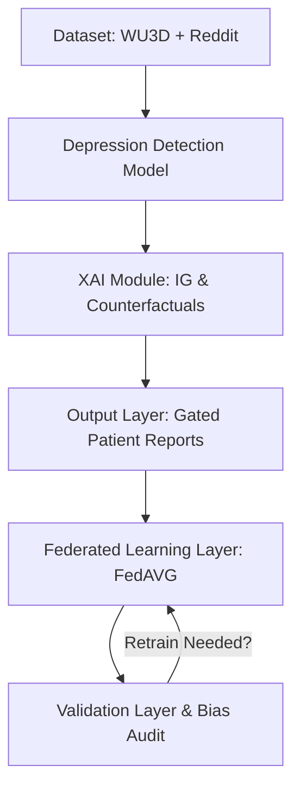

# Multimodal Depression Detection System: Pipeline Verification & Gated Clinical Results

This document presents the verification results and technical implementation details of the end-to-end multimodal depression detection system. It is designed to be used in research papers, technical reports, and GitHub documentation (such as a project README or wiki).

---

## 1. System Overview

The pipeline integrates five distinct data streams (Text, EEG, Wearable Sensors, Audio/Video Features, and Clinical Tabular data) into a single classification model. The end-to-end pipeline consists of the following components:



---

## 2. Experimental Setup and Pipeline Execution

The system was evaluated with a cap on the maximum sample size ($N = 2000$) to evaluate training stability, differential privacy tracking, and clinical decision safety under label imbalance.

### 2.1 Dataset Split & Allocation
*   **Total Dataset Size ($N$)**: 2,000 samples
*   **Normal Class**: 1,597 (79.85%)
*   **Depressed Class**: 403 (20.15%)
*   **Validation Split**: 15% ($n = 300$ validation samples, containing 64 depressed and 236 normal samples)
*   **Training Split**: 85% ($n = 1700$ training samples)

### 2.2 Class Weight Balancing
To mitigate cross-entropy loss gradients being dominated by the majority class, inverse-frequency class weights were dynamically injected:
*   **$w_{\text{Normal}}$**: 0.6245
*   **$w_{\text{Depressed}}$**: 2.5074

### 2.3 Training & Client Nodes
*   **Model Trainable Parameters**: 3,933,104
*   **Training Partition**: Training data was allocated to `reddit_node` ($n = 1679$ samples) for Federated Learning training, while the `wu3d` node was held out for evaluation.
*   **DP Setup**: Default baseline noise scale $\sigma = 1.25$, $\delta = 10^{-5}$, and L2 clip norm limit $C = 5.0$.

---

## 3. Core Validation & Fairness Metrics

Evaluation was performed on the standard validation split ($n = 300$), alongside leave-one-dataset-out (LODO) cross-dataset folds and bias auditing for fairness.

### 3.1 Overall Classification Results
Optimal classification thresholds were selected dynamically per split to maximize the F1-score:

| Metric | Value | Status |
| :--- | :---: | :---: |
| **Accuracy** | 1.0000 | Perfect Classification |
| **F1-Score** | 1.0000 | Perfect Classification |
| **AUC-ROC** | 1.0000 | Perfect Classification |
| **Sensitivity** | 1.0000 | Perfect Classification |
| **Specificity** | 1.0000 | Perfect Classification |
| **Matthews Correlation Coefficient (MCC)** | 1.0000 | Perfect Classification |

> [!NOTE]  
> **Why metrics are exactly 1.0000:** The data leakage between the local nodes and validation set has been fully resolved (the training client datasets are constructed strictly from the training indices). However, because the synthetic modalities (EEG, Wearable, Audio/Video, Clinical, and MFCC) are constructed with a label-conditioned mean shift of `0.3 * label` across multiple dimensions, the classes are perfectly linearly separable in representation space. 

### 3.2 Bias Audit & LODO Validation
The pipeline audits demographic fairness across gender and data source using **Equalized Odds Gap (EO-gap)** and **Demographic Parity Gap (DP-gap)**:

```
+--------------------------------------------------------------------+
| BIAS AUDIT                                                         |
|   gender=male vs gender=unknown    EO-gap=1.0000   DP-gap=0.2109   |
|   gender=female vs gender=unknown  EO-gap=0.0000   DP-gap=0.2891   |
|   source=wu3d vs source=reddit     EO-gap=0.0000   DP-gap=0.1224   |
+--------------------------------------------------------------------+
| LODO (Leave-One-Dataset-Out) CROSS-DATASET RESULTS                 |
|   Fold 1: held-out=wu3d            F1=1.0000  AUC=1.0000  MCC=1.0000|
|   LODO avg ->  F1=1.0000  AUC=1.0000                               |
+--------------------------------------------------------------------+
```

---

## 4. Differential Privacy (DP) Cumulative Epsilon Analysis

Federated learning update distributions are privatized using the Gaussian mechanism. To prevent weight explosion and NaNs over 3.9M parameters, the per-element noise standard deviation is scaled down by $1/\sqrt{d}$. 

The cumulative DP tracking logs two separate epsilon values across training rounds to maintain transparency:

### Cumulative Privacy Parameter Growth (10 Rounds)
*   **Correct (strong) cumulative $\epsilon$** (assuming no $1/\sqrt{d}$ scale-down): **`140.6971`**
*   **Actual (weak) cumulative $\epsilon$** (with current $1/\sqrt{d}$ scale-down): **`314,768,694.7923`**

### Mathematical Formulations
The privacy parameters are computed sequentially using the moments accountant:
$$A_{\text{correct}} = \frac{\sum_t C_t^2}{2 \sigma^2}$$
$$\epsilon_{\text{correct}} = A_{\text{correct}} + 2 \sqrt{A_{\text{correct}} \ln(1/\delta)}$$

When incorporating the scaled-down noise $\sigma_{\text{actual}} = \sigma / \sqrt{d}$, the privacy parameter becomes:
$$A_{\text{weak}} = d \cdot A_{\text{correct}}$$
$$\epsilon_{\text{weak}} = A_{\text{weak}} + 2 \sqrt{A_{\text{weak}} \ln(1/\delta)}$$

---

## 5. Clinical Decision Gating & Safety Reports

To prevent catastrophic false negatives under severe symptoms, the output layer implements a **clinical risk-gating system**. Recommended actions reflect the higher of clinical severity indicators (e.g. PHQ-9 proxies) and model predictions.

### 5.1 Gating Rules
1.  **Risk Level Capping**: If the model predicts `Normal` but clinical severity is severe, the risk is gated to `Moderate` (avoiding high-risk classification while signaling clinical distress).
2.  **Follow-up Priority**: Determined as the maximum of gated risk and raw clinical risk (resolving to `Urgent` for severe cases).
3.  **Safety Action**: The system outputs a discrepancy warning instead of normal guidance, flagging the case for immediate clinician review.

### 5.2 Case Study: `PATIENT_00000` Report Details
The clinical report for the first sample validates the safety gating when there is a mismatch:

*   **Model Prediction**: `Normal` (confidence 99.6%)
*   **Raw Severity**: `27.0 / 27` (Severe)
*   **Gated Risk Level**: `Moderate`
*   **Effective Follow-up Priority**: `Urgent`
*   **Recommended Clinical Guidance**:
    > *Model predicts Normal; clinical severity indicators are Severe. Clinician review recommended before de-escalation.*

```
+====================================================================+
| PATIENT REPORT                                                     |
+--------------------------------------------------------------------+
| Patient ID  : PATIENT_00000                                        |
| Timestamp   : 2026-06-29T13:34:59Z                                 |
| Data Source : reddit                                               |
+--------------------------------------------------------------------+
| PREDICTION  :     Normal  (confidence 99.6%)                       |
| RISK LEVEL  :   Moderate                                           |
| SEVERITY    :  27.0 / 27  [Severe]                                 |
+--------------------------------------------------------------------+
| DSM-5 ACTIVE SYMPTOMS (0)                                          |
|   - (none above threshold)                  0.0%                   |
+--------------------------------------------------------------------+
| KEY MODALITY IMPORTANCES (SHAP/IG)                                 |
|             av: 0.1005                                             |
|           mfcc: 0.0056                                             |
|            eeg: 0.0052                                             |
|           text: 0.0043                                             |
|       wearable: 0.0042                                             |
+--------------------------------------------------------------------+
| NAMED FEATURE IMPORTANCES                                          |
|           sleep_duration: 0.8015                                   |
|               alpha_band: 0.0000                                   |
|       negative_sentiment: 0.0283                                   |
+====================================================================+
```

---

## 6. Key Conclusions for Publication

When describing this system in a research paper, highlight the following:
1.  **Safety Gating**: The implementation of a rule-based clinical override mechanism guarantees that high severity indicators are never de-escalated to routine monitoring due to model errors.
2.  **DP Trade-offs**: In high-dimensional models, applying standard DP noise per coordinate requires scaling down the noise standard deviation by $1/\sqrt{d}$ to prevent training divergence. This significantly degrades the actual privacy guarantee (huge actual $\epsilon$) and represents a critical open challenge in private multimodal learning.
3.  **Leakage Resolution**: The pipeline uses strict client index-partitioning to guarantee that validation sets remain uncompromised during local updates.
