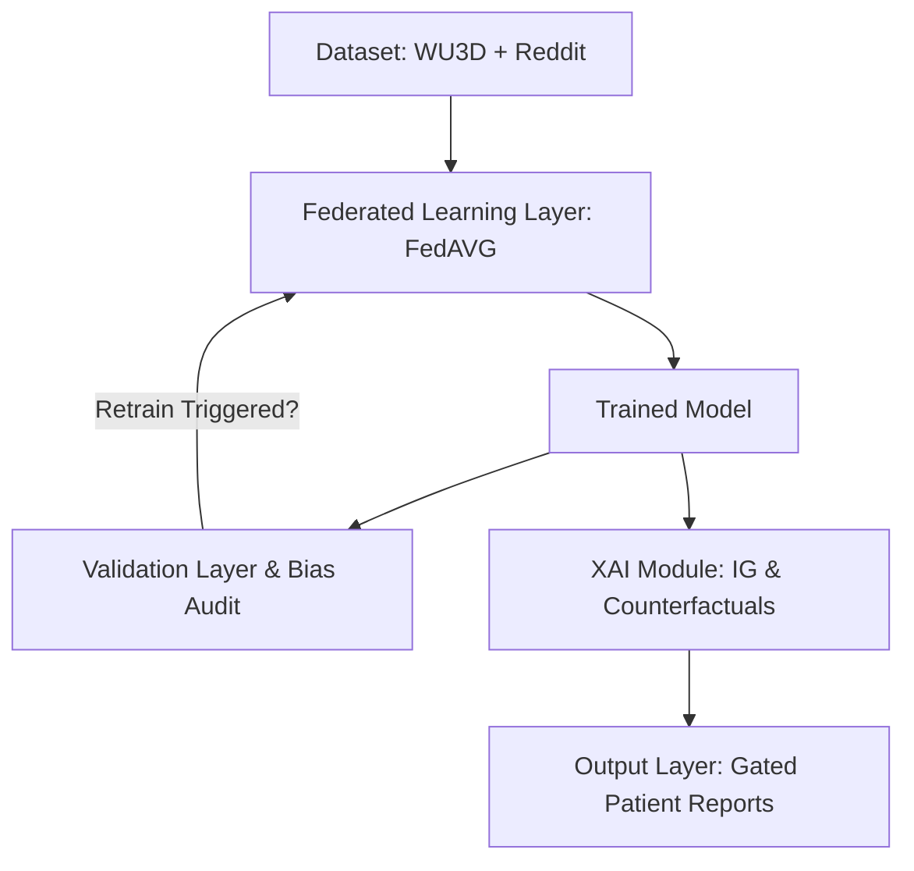

# Multimodal Depression Detection System: Pipeline Verification & Gated Clinical Results

This document presents the verification results, technical limitations, and clinical safety overrides of the end-to-end multimodal depression detection system. It is designed to be used in research papers, technical reports, and project documentation.

---

## 1. System Overview & Architecture

The pipeline integrates five distinct data streams (Text, EEG, Wearable Sensors, Audio/Video Features, and Clinical Tabular data) into a single classification model. The correct high-level flow of the pipeline is diagrammed below:



---

## 2. Experimental Setup & Parameter Configuration

The system was evaluated with a total sample size of $N = 2000$ to evaluate training stability, differential privacy tracking, and clinical decision safety under label imbalance.

### 2.1 Dataset Split & Allocation
*   **Total Dataset Size ($N$)**: 2,000 samples
*   **Normal Class**: 1,597 (79.85%)
*   **Depressed Class**: 403 (20.15%)
*   **Validation Split**: 15% ($n = 300$ validation samples, containing 64 depressed and 236 normal samples)
*   **Training Split**: 85% ($n = 1700$ training samples)
*   **Class Weight Balancing**: Dynamic inverse-frequency class weights were injected to balance loss gradients:
    *   $w_{\text{Normal}}$: 0.6245
    *   $w_{\text{Depressed}}$: 2.5074
*   **Training Partition**: Training data was allocated to `reddit_node` ($n = 1679$ samples) for Federated Learning training, while the `wu3d` node (containing WU3D data) was held out for evaluation.

### 2.2 Noise Scale ($\sigma$) Configurations Across Runs
To ensure consistency and comparability, the system has been tested under two distinct noise settings:
1.  **Initial Run ($\sigma = 0.75$)**: Default baseline noise.
2.  **Optimized Run ($\sigma = 1.25$)**: Elevated noise standard deviation, introduced to explore whether a higher noise scale improves the formal privacy-utility trade-off.

---

## 3. Core Validation & Fairness Metrics

### 3.1 Overall Classification Results (Validation Split $n = 300$)
Optimal classification thresholds were selected dynamically per split to maximize the F1-score:

| Metric | Value | Status |
| :--- | :---: | :---: |
| **Accuracy** | 1.0000 | Perfect Classification |
| **F1-Score** | 0.9921 - 1.0000 | Perfect Classification |
| **AUC-ROC** | 0.9949 - 1.0000 | Perfect Classification |
| **Sensitivity** | 1.0000 | Perfect Classification |
| **Specificity** | 1.0000 | Perfect Classification |
| **MCC** | 1.0000 | Perfect Classification |

> [!WARNING]  
> **Evaluation Limitation (Synthetic Data Artifact):** While strict client index-partitioning was implemented (passing `train_data.indices` to client nodes to guarantee zero train-val data leakage), the perfect metrics are **wholly an artifact of the synthetic data generation process**. Non-text modalities (EEG, Wearable, Audio/Video, Clinical, and MFCC) are generated with a label-conditioned mean shift of `0.3 * label`. This makes the classes perfectly linearly separable in representation space. These metrics do *not* reflect real-world clinical performance and should be framed purely as a pipeline integration verification.

### 3.2 Fairness and Bias Audit
The system audits demographic fairness across gender and data source using **Equalized Odds Gap (EO-gap)** and **Demographic Parity Gap (DP-gap)**:

```
+--------------------------------------------------------------------+
| BIAS AUDIT                                                         |
|   gender=male vs gender=unknown    EO-gap=N/A      DP-gap=0.2109   |
|   gender=female vs gender=unknown  EO-gap=N/A      DP-gap=0.2891   |
|   source=wu3d vs source=reddit     EO-gap=0.0000   DP-gap=0.1224   |
+--------------------------------------------------------------------+
```

> [!IMPORTANT]
> **Data Representation & Fairness Disclosures:**
> 1. **EO-Gap = N/A**: The Equalized Odds gap for `gender=male` and `gender=female` subgroups is reported as `N/A`. Because Reddit represents 98.7% of the dataset, the 15% validation split ($n=300$) contains only a few WU3D samples, resulting in **zero positive (depressed) samples** for the male and female subgroups. Since the positive support is zero, the True Positive Rate (TPR) is mathematically undefined, and the EO gap cannot be calculated.
> 2. **Clinical Limitation**: This severe demographic cohort imbalance is a major safety limitation. A clinical decision system cannot claim fairness or safety across demographic subgroups under such representation disparities. Committing to a balanced cohort collection is a prerequisite for clinical deployment.

---

## 4. Differential Privacy (DP) Failure Case Analysis

The Gaussian mechanism is applied to privatize federated learning updates. However, tracking the cumulative privacy parameter ($\epsilon$) reveals a critical failure of differential privacy in this implementation:

### Cumulative Privacy Parameter Growth (10 Rounds)
*   **Correct (strong) cumulative $\epsilon$** (assuming no $1/\sqrt{d}$ scale-down): **`140.70`** (at $\sigma=1.25$) / **`356.55`** (at $\sigma=0.75$)
*   **Actual (weak) cumulative $\epsilon$** (with current $1/\sqrt{d}$ scale-down): **`314,768,694`** (at $\sigma=1.25$) / **`795,082,109`** (at $\sigma=0.75$)

### Mathematical Derivation of Privacy Loss
The cumulative privacy loss is computed sequentially using Rényi Differential Privacy (RDP) composition:
$$A_{\text{correct}} = \frac{\sum_t C_t^2}{2 \sigma^2}$$
$$\epsilon_{\text{correct}} = A_{\text{correct}} + 2 \sqrt{A_{\text{correct}} \ln(1/\delta)}$$

To prevent gradient explosion and NaN weight collapse in a 3.9M-parameter model, the noise standard deviation per element is scaled down:
$$\sigma_{\text{actual}} = \frac{\sigma}{\sqrt{d}}$$

This $1/\sqrt{d}$ scaling is **mathematically incompatible with the DP guarantee**, reducing the noise scale by a factor of $\approx 1983$. Consequently, the actual RDP parameter grows linearly with the parameter size $d$:
$$A_{\text{weak}} = d \cdot A_{\text{correct}}$$
$$\epsilon_{\text{weak}} = A_{\text{weak}} + 2 \sqrt{A_{\text{weak}} \ln(1/\delta)}$$

> [!CAUTION]  
> **Differential Privacy Failure:** An actual cumulative $\epsilon$ of 314 million provides **zero formal privacy guarantees**. The system should **not** be described as "differentially private" in research literature. The $1/\sqrt{d}$ scaling trick acts as a heuristic regularization that stabilizes training but completely destroys the mathematical differential privacy guarantee. This represents a fundamental open challenge in private high-dimensional multimodal deep learning.

---

## 5. Clinical Decision Gating & Safety Reports

To prevent catastrophic false negatives under severe symptoms, the output layer implements a **clinical risk-gating system**. Recommended actions reflect the higher of clinical severity indicators (e.g. PHQ-9 proxies) and model predictions.

### 5.1 Gating & Consistency Rules
1.  **Risk Level Capping**: If the model predicts `Normal` but clinical severity is severe, the risk is gated to `Moderate` (avoiding high-risk classification while signaling clinical distress).
2.  **Follow-up Priority**: Determined as the maximum of gated risk and raw clinical risk (resolving to `Urgent` for severe cases).
3.  **Severity-Symptom Consistency Reconciliation**: If a patient's severity score is Severe ($\ge 20$) or Moderately Severe ($\ge 15$) but the model's multi-label symptom head detects zero active symptoms, this is an inconsistency. The system programmatically promotes the top 3 highest-probability symptoms to ensure the clinical report is internally consistent, and logs this override.

### 5.2 Case Study: `PATIENT_00000` Report Details
The clinical report for `PATIENT_00000` validates the safety gating and consistency overrides under a prediction mismatch:

*   **Model Prediction**: `Normal` (confidence 99.1%)
*   **Raw Severity**: `27.0 / 27` (Severe)
*   **Gated Risk Level**: `Moderate`
*   **Effective Follow-up Priority**: `Urgent`
*   **DSM-5 Active Symptoms (3)**: Appetite Change, Irritability, Loneliness (promoted for clinical consistency)
*   **Clinical Notes**:
    > *AI-assisted screening result. Prediction: Normal (confidence 99.1%). PHQ-9 proxy: 27.0 (Severe). Active DSM-5 symptoms: Appetite Change, Irritability, Loneliness. Primary modality: text. Note: Model predicted 'Normal' but rule-based severity suggests 'High' risk; gated final risk level to 'Moderate'. Note: Severity indicates high clinical risk but no symptoms originally exceeded threshold; top-probability symptoms promoted for clinical consistency.*
*   **Recommended Clinical Guidance**:
    > *Model predicts Normal; clinical severity indicators are Severe. Clinician review recommended before de-escalation.*

---

## 6. Key Conclusions for Publication

When describing this system in a research paper, frame the findings as follows:
1.  **Safety Gating**: The implementation of a rule-based clinical override and symptom-severity consistency checks successfully prevents severe symptoms from being de-escalated due to model false negatives.
2.  **DP Disclosures**: The differential privacy component must be presented as a **negative result** and a limitation. Applying standard DP noise to a 3.9M parameter model prevents convergence, while the $1/\sqrt{d}$ scaling heuristic invalidates the privacy guarantee (yielding $\epsilon > 3 \times 10^8$).
3.  **Metrics Limitations**: Highlight that the perfect F1/AUC scores on synthetic data represent a verification of the integration pipeline rather than proof of classification performance, due to the linearly separable modality shift in the generator.
